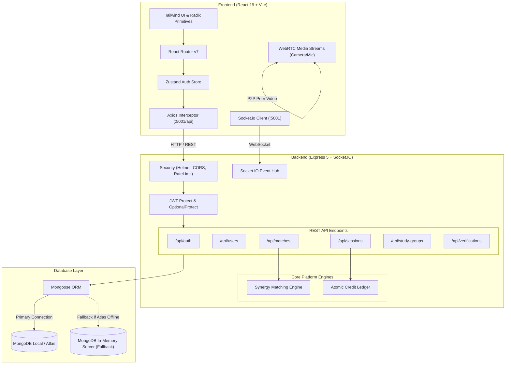
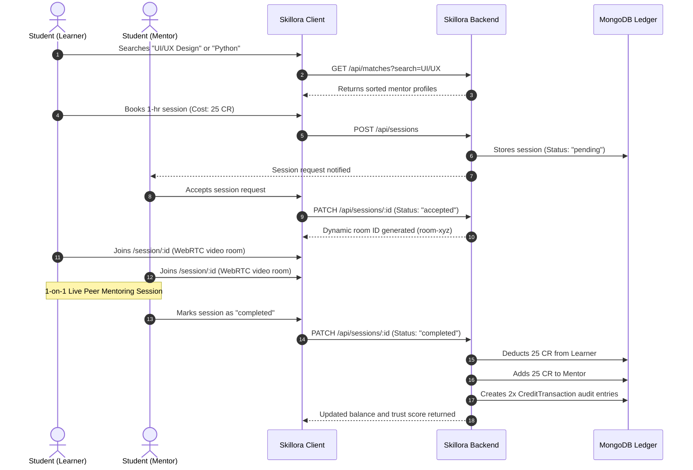

# Skillora

> **A decentralized, credit-based peer-to-peer knowledge exchange and live mentoring platform for university students.**

[](https://react.dev/)
[](https://vitejs.dev/)
[](https://nodejs.org/)
[](https://socket.io/)
[](https://www.mongodb.com/)
[](https://tailwindcss.com/)
[](#-license)

---

## 📌 Overview

**Skillora** is a decentralized, skill-for-skill exchange ecosystem that transforms collegiate peer mentoring into an accessible, equitable circular economy. 

### The Problem
- **Exorbitant Private Tutoring Costs**: Students often cannot afford commercial 1-on-1 tutoring, bootcamps, or premium course subscriptions.
- **Isolated Campus Knowledge**: High-performing students with niche expertise (e.g., UI/UX design, LLM fine-tuning, competitive programming) have no structured campus outlet to teach and be compensated.
- **Passive Learning Fatigue**: Video courses provide zero real-time peer feedback, while traditional tutoring platforms enforce rigid monetary paywalls.
- **Unverified Skill Claims**: Academic resumes lack verifiable proof of authentic peer teaching, communication aptitude, and collaborative problem solving.

### The Solution
Skillora replaces traditional monetary barriers with an **earned credit economy (time banking)**. 
- **Earn While You Teach**: Share your expertise in 1-on-1 live video classrooms and earn platform credits (`CR`).
- **Spend to Learn Anything**: Use your earned credits to book personalized tutoring sessions from verified campus peers across disciplines.
- **Zero Tuition Fees**: Everyone starts with complimentary starter credits, democratizing hands-on education across university campuses.
- **Career-Ready Proof**: Every completed session automatically contributes to an authentic trust score, peer ratings, and an exportable AI-verified portfolio resume.

---

## ✨ Features

### 👤 User & Authentication
- **Dual Role Accounts**: Every user can seamlessly act as both a **Learner** and a **Teacher** without switching accounts.
- **Multi-Stage Onboarding**: 3-step signup wizard (Account Details → Skill Matrix & Hourly Rate → Campus Profile).
- **Secure JWT Authentication**: 30-day token persistence with automatic refresh token verification and bearer authorization.
- **1-Click Demo Profiles**: Pre-seeded demo credentials for instant local evaluation without registration friction.
- **Campus Affiliation**: Profile tagging for major institutions (BITS Pilani, IIT Bombay, IIT Madras, NID Ahmedabad, etc.).

### 🤝 Peer Matching & Discovery
- **Synergy Matching Engine**: Multi-factor scoring algorithm calculating skill alignment, mentor ratings, availability, and language preferences:
  $$\text{Score} = (0.4 \times \text{Skill}) + (0.2 \times \text{Rating}) + (0.2 \times \text{Availability}) + (0.2 \times \text{Language})$$
- **Real-Time Skill Search**: Instant debounced search querying mentor names, offered skills, and wanted topics.
- **Guest Visitor Browsing**: Unauthenticated landing page exploration enabling prospective students to discover active campus mentors before signing up.
- **Discipline Photo Strips**: Curated real-world category showcases across UI/UX Design, Fullstack & AI, Digital Illustration, Film & Video Editing, and Career Mentoring.

### 💰 Circular Credit Economy & Wallet
- **Time Banking Engine**: Transparent hourly credit rates (`CR/hr`) attached to each skill offering.
- **Atomic Credit Transfers**: Double-entry ledger recording deductions from learners and credits to teachers with balance verification.
- **Transaction Audit Logs**: Timestamped history detailing earned fees, lesson payments, system bonuses, and balance snapshots.
- **Dynamic Valuation**: Algorithmically adjusts credit recommendations based on campus demand multipliers.

### 📹 Live WebRTC Video Classroom
- **In-Browser Video Sessions**: Built-in 1-on-1 video call room with dynamic unique room IDs (`room-{sessionId}-{hash}`).
- **Hardware Controls**: Live toggles for camera mute/unmute and microphone mute/unmute.
- **Real-Time Session Timer**: Active call duration counter ensuring transparent billing tracking.
- **In-Call Peer Chat Drawer**: Side-by-side text chat and code sandbox note-taking alongside live video feeds.

### 💬 Real-Time Messaging & Chat
- **Socket.IO Real-Time Engine**: Low-latency bidirectional communication between matched peers.
- **Master-Detail Layout**: Responsive contact list and conversation pane with automatic mobile slide-over.
- **Unread Counters & Status**: Online presence indicators, typing feedback, and timestamped message delivery.

### 👥 Collaborative Study Groups
- **Topic-Based Cohorts**: Create and discover student study groups by academic or technical subject.
- **Member Quotas**: Cap group sizes (e.g., 50 members) to maintain high discussion quality.
- **Announcements & File Feeds**: Shared repositories for study materials, notes, and group updates.

### 🛡️ Skill Verification Gateway
- **Multi-Proof Submissions**: Students submit GitHub repositories, live demo URLs, certificates, and portfolio links.
- **Admin Verification Portal**: Privileged review dashboard allowing administrators to approve, reject, and award verified badges.
- **Trust Badges**: Verified checkmarks rendered on mentor profiles and search cards upon approval.

### 🤖 Skillora AI Assistant
- **Context-Aware Recommendations**: Route-aware suggestion chips adapting to whether the user is on the Dashboard, Matches, or Credits page.
- **Interactive Peer Advisor**: Answers student questions regarding credit rules, top-rated mentors, and schedule optimizations.

### 📄 AI-Verified Resume Builder
- **Automated Portfolio Generation**: Transforms raw platform metrics (hours taught, ratings, peer reviews, verified skills) into an authentic resume.
- **Template Styles**: Switch between **Modern Professional** and **Academic Peer Impact** layouts.
- **Print & PDF Export**: Native browser print styling for 1-click clean PDF resume downloads.

### 📊 Comprehensive Analytics Dashboard
- **Interactive Credit Visualizer**: 7-day Recharts bar chart tracking credits earned vs. spent.
- **Session Lifecycle Management**: Filter between upcoming sessions, pending requests, and completed archives.
- **Trust Score Gauge**: Visual metric reflecting session completion rates and student feedback.

### 🏆 Community Leaderboard
- **Podium Rankings**: 1st, 2nd, and 3rd place podium cards celebrating top campus peer mentors.
- **Honor Roll Directory**: Ranked list sorting students by total platform credits, trust rating, and sessions taught.

---

## 🛠️ Tech Stack

### Frontend
| Technology | Description |
| :--- | :--- |
| **React 19** | Modern UI component rendering with hooks and concurrent features |
| **Vite 8** | Next-generation fast frontend tooling and dev server |
| **React Router v7** | Declarative client-side routing with deep link support |
| **Tailwind CSS v3** | Utility-first CSS framework customized with semantic color tokens |
| **Zustand** | Lightweight, reactive state management store for authentication |
| **Socket.IO Client** | Real-time WebSocket communication for messaging and presence |
| **Axios** | HTTP client with automatic Bearer token interceptors and 401 recovery |
| **Recharts** | Composable charting library for dashboard financial metrics |
| **Lucide React** | Consistent, modern icon set |
| **Radix UI** | Accessible, unstyled UI primitives (Dialogs, Tabs, Progress, Avatar) |

### Backend
| Technology | Description |
| :--- | :--- |
| **Node.js** | Event-driven JavaScript runtime environment |
| **Express 5** | RESTful routing and API middleware infrastructure |
| **Socket.IO 4** | Real-time bidirectional WebSocket server |
| **Mongoose 9** | Strict schema validation and document modeling for MongoDB |
| **MongoDB Memory Server** | Automatic in-memory database fallback for zero-configuration local runs |
| **JWT (jsonwebtoken)** | Stateless session management with 30-day token expiration |
| **Bcrypt** | Salted password hashing (12 rounds) |
| **Helmet** | HTTP security headers protecting against common web exploits |
| **Express Rate Limit** | Request throttling protecting auth and API endpoints against brute force |

---

## 🏗️ Project Architecture



### Communication Flow
1. **REST API**: Client interacts with the Express backend over HTTP using Axios, with automatic Authorization header injection via interceptors.
2. **Real-Time Events**: Real-time messaging and peer chat emit events through the Socket.IO cluster.
3. **Audio / Video Streams**: Live video sessions request camera and microphone permissions via standard browser `navigator.mediaDevices.getUserMedia`.
4. **Resilient Persistence**: On server boot, backend attempts connection to MongoDB at `MONGO_URI`. If MongoDB is not running locally, it gracefully starts an isolated in-memory MongoDB server (`mongodb-memory-server`) with auto-seeded demo accounts.

---

## 📂 Project Structure

```text
Skillora/
├── backend/
│   ├── controllers/
│   │   ├── authController.js         # Signup, login, demo auto-provisioning, JWT tokens
│   │   ├── matchController.js        # Synergy calculation, search, guest mentor discovery
│   │   ├── sessionController.js      # Session booking, acceptance, atomic credit transfers
│   │   ├── studyGroupController.js   # Group creation, membership, announcements
│   │   ├── userController.js         # Profiles, 7-day stats aggregation, leaderboard
│   │   └── verificationController.js # Proof submission and admin review actions
│   ├── middleware/
│   │   └── authMiddleware.js         # protect, optionalProtect, and admin role guards
│   ├── models/
│   │   ├── Badge.js                  # Achievement badge definitions
│   │   ├── Chat.js                   # Conversation thread metadata
│   │   ├── CreditTransaction.js      # Double-entry ledger records
│   │   ├── Message.js                # Direct chat message documents
│   │   ├── Notification.js           # User alerts and system updates
│   │   ├── Report.js                 # Moderation and report tracking
│   │   ├── Session.js                # Booking records, room IDs, and ratings
│   │   ├── StudyGroup.js             # Cohorts, shared files, and group announcements
│   │   ├── User.js                   # User schema, skills matrix, credits, trust metrics
│   │   └── Verification.js           # Skill verification requests and audit trails
│   ├── routes/
│   │   ├── authRoutes.js             # /api/auth routes
│   │   ├── matchRoutes.js            # /api/matches routes
│   │   ├── sessionRoutes.js          # /api/sessions routes
│   │   ├── studyGroupRoutes.js       # /api/study-groups routes
│   │   ├── userRoutes.js             # /api/users routes
│   │   └── verificationRoutes.js     # /api/verifications routes
│   ├── services/
│   │   ├── creditEngine.js           # Atomic balance validation and transfers
│   │   ├── matchingEngine.js         # Weighted 4-factor peer synergy logic
│   │   └── seed.js                   # Mock user generators
│   ├── db.js                         # Database connector with In-Memory fallback
│   ├── package.json                  # Backend dependencies and run scripts
│   └── server.js                     # Express app setup, Socket.IO, middleware, port listener
│
├── frontend/
│   ├── public/
│   │   └── assets/categories/        # Real-world photography assets for disciplines
│   ├── src/
│   │   ├── components/
│   │   │   ├── layout/
│   │   │   │   ├── AIAssistant.jsx   # Floating Skillora AI assistant widget
│   │   │   │   ├── Footer.jsx        # Semantic responsive 5-column footer
│   │   │   │   └── Navbar.jsx        # Navigation bar with theme toggle & mobile drawer
│   │   │   └── ui/                   # Radix UI primitives (Button, Card, Tabs, Dialog)
│   │   ├── hooks/
│   │   │   └── use-toast.ts          # Toast notification hook
│   │   ├── lib/
│   │   │   ├── api.js                # Configured Axios instance with auth interceptors
│   │   │   └── utils.js              # Class merging utilities (clsx, tailwind-merge)
│   │   ├── pages/
│   │   │   ├── About.jsx             # Platform mission and philosophy
│   │   │   ├── Admin.jsx             # Platform Command Center & Diagnostics
│   │   │   ├── Careers.jsx           # Student ambassador and engineering openings
│   │   │   ├── Chat.jsx              # Socket.IO real-time direct messaging
│   │   │   ├── Contact.jsx           # Support inquiry form
│   │   │   ├── Credits.jsx           # Wallet ledger, balance cards, trust score
│   │   │   ├── Dashboard.jsx         # Analytics dashboard with Recharts financial chart
│   │   │   ├── Home.jsx              # Landing page with flanking elements & category cards
│   │   │   ├── Leaderboard.jsx       # Peer educator rankings and podium
│   │   │   ├── LiveSession.jsx       # WebRTC video room with media controls & chat
│   │   │   ├── Login.jsx             # Authentication portal with 1-click demo access
│   │   │   ├── Matches.jsx           # Searchable peer mentor catalog & booking modal
│   │   │   ├── NotFound.jsx          # 404 recovery page
│   │   │   ├── Premium.jsx           # Pricing tiers (Free, Pro, Enterprise)
│   │   │   ├── Profile.jsx           # Student profile, skills offered/wanted, trust rating
│   │   │   ├── ResumeBuilder.jsx     # AI-verified career resume builder with PDF export
│   │   │   ├── Sessions.jsx          # Session scheduling, management, and history
│   │   │   ├── Settings.jsx          # Profile updates, theme cards, notification settings
│   │   │   ├── Signup.jsx            # 3-step onboarding registration wizard
│   │   │   ├── StudyGroups.jsx       # Cohort study group explorer and discussions
│   │   │   └── Verification.jsx      # Skill badge verification submission
│   │   ├── store/
│   │   │   └── authStore.js          # Zustand authentication store
│   │   ├── App.jsx                   # Route declarations and root theme provider
│   │   ├── index.css                 # Global CSS variables, animations, and typography
│   │   └── main.jsx                  # React DOM entry point
│   ├── package.json                  # Frontend dependencies and Vite build scripts
│   ├── tailwind.config.js            # Tailwind CSS configuration with HSL semantic tokens
│   └── vite.config.js                # Vite build and path alias configuration
│
└── README.md                         # Comprehensive project documentation
```

---

## 🚀 Getting Started

Follow these step-by-step instructions to set up and run Skillora on your local development machine.

### Prerequisites
- **Node.js**: `v18.0.0` or higher ([Download Node.js](https://nodejs.org/))
- **npm**: `v9.0.0` or higher (bundled with Node.js)
- **MongoDB**: *(Optional)* Local MongoDB instance or MongoDB Atlas. If no MongoDB is detected, Skillora **automatically spins up an in-memory MongoDB instance** so you can test immediately with zero configuration!

---

### Installation

1. **Clone the repository**:
   ```bash
   git clone https://github.com/siddheshsonje29-coder/Skillora.git
   cd Skillora
   ```

2. **Install Backend Dependencies**:
   ```bash
   cd backend
   npm install
   ```

3. **Install Frontend Dependencies**:
   ```bash
   cd ../frontend
   npm install
   ```

---

### Environment Variables

#### 1. Backend Configuration
Create a `.env` file in the `backend/` directory:
```bash
# Path: backend/.env
PORT=5001
FRONTEND_URL=http://localhost:5173
JWT_SECRET=your_super_secret_jwt_access_key
JWT_REFRESH_SECRET=your_super_secret_jwt_refresh_key
MONGO_URI=mongodb://127.0.0.1:27017/skillora
```
> **Note**: If `MONGO_URI` cannot be reached, the server automatically starts the built-in in-memory database fallback.

#### 2. Frontend Configuration
Create a `.env` file in the `frontend/` directory:
```bash
# Path: frontend/.env
VITE_API_URL=http://localhost:5001/api
VITE_API_BASE_URL=http://localhost:5001
```

---

## ▶️ Running the Project

### Option A: Running Backend and Frontend Concurrently

**Terminal 1 — Start the Backend Server**:
```bash
cd backend
npm run dev
# or: node server.js
```
*The backend will initialize on `http://localhost:5001` and output confirmation of MongoDB or In-Memory connection and pre-seeded demo users.*

**Terminal 2 — Start the Frontend Dev Server**:
```bash
cd frontend
npm run dev
```
*The client will launch on `http://localhost:5173`.*

---

### Pre-Seeded Demo Accounts
For instant evaluation without having to register new accounts, use any of the following credentials (all use password: `password123`):

| Email | Name | College | Primary Skill | Credits |
| :--- | :--- | :--- | :--- | :--- |
| `siddhesh@skillora.com` | Siddhesh Jain | BITS Pilani | Fullstack & AI Builder | 100 CR |
| `ayush@skillora.com` | Ayush Sharma | IIT Bombay | Frontend Architect (React) | 120 CR |
| `mrunali@skillora.com` | Mrunali Patel | NID Ahmedabad | Lead Product Designer (Figma) | 150 CR |
| `aravind@skillora.com` | Aravind Iyer | IIT Madras | ML Researcher (Python/PyTorch) | 100 CR |

> **Pro Tip**: The login screen features **1-Click Quick Demo Login** buttons that fill and authenticate these profiles instantly!

---

## 🔐 Authentication & Security

- **Bcrypt Hashing**: Passwords are encrypted with a cost factor of 12 before being saved to the database. Plaintext passwords are never stored or logged.
- **JWT Authorization**: Requests to protected routes require a valid Bearer token in the `Authorization` header (`Authorization: Bearer <token>`). Tokens have a generous 30-day expiration for uninterrupted testing.
- **Role-Based Guards**:
  - `protect`: Enforces authenticated user sessions across private dashboards, live rooms, and chat.
  - `optionalProtect`: Permits guest exploration while attaching user context if a token is present.
  - `admin`: Restricts access to sensitive platform diagnostics and verification approval routes.
- **Defense in Depth**:
  - **Helmet**: Secures HTTP response headers against Cross-Site Scripting (XSS), clickjacking, and MIME-type sniffing.
  - **Express Rate Limiting**: Throttles malicious requests on sensitive endpoints (`1000` requests per 15-minute window for auth, `2000` for general APIs).
  - **CORS Configuration**: Explicitly permits requests from `FRONTEND_URL` while supporting credentials.

---

## 🤖 AI / Intelligent Features

### 1. Skillora AI Assistant
A context-aware floating assistant accessible across every view of the application:
- **Location-Aware Prompts**: If on the `/dashboard`, suggests tips on earning credits and setting study goals. If on `/matches`, suggests mentor recommendations. If on `/credits`, explains trust score rules.
- **Interactive Knowledge Hub**: Provides natural language guidance on scheduling lessons, peer etiquette, and platform mechanics.

### 2. Multi-Factor Synergy Algorithm
The matchmaking service calculates a weighted compatibility score between learners and mentors:
- Exact skill matches: **40% weight**
- Mentor historical rating: **20% weight**
- Availability alignment: **20% weight**
- Preferred spoken language: **20% weight**

### 3. AI-Verified Portfolio Resume
Automatically synchronizes platform teaching hours, student satisfaction scores, and verified skill badges into an industry-formatted PDF resume with modern and academic typography presets.

---

## 🔄 Application Workflow



---

## 📊 Dashboard

The **Skillora Dashboard** (`/dashboard`) provides students with a real-time operational overview of their academic knowledge exchange:

1. **Top Metric Cards**:
   - **Current Wallet Balance**: Available platform credits with 1-click earn action.
   - **Trust Score**: Reliability rating (0–100) reflecting attendance and completion fidelity.
   - **Total Credits Earned**: Lifetime credits accumulated through teaching.
   - **Hours Taught**: Total peer classroom time contributed to the community.
2. **Recharts Financial Visualizer**:
   - 7-day adaptive bar chart contrasting credits earned through teaching against credits spent on learning.
3. **Session Management Tabs**:
   - **Overview Tab**: Upcoming scheduled appointments with countdown badges and direct live room entry buttons.
   - **Learning Tab**: All lessons where the user is receiving instruction.
   - **Teaching Tab**: All lessons where the user is providing instruction.

---

## 🎨 UI/UX Design System

- **Curated Color Tokens**: Full semantic HSL color palette implemented with CSS variables (`--background`, `--foreground`, `--primary`, `--card`, `--muted`, `--border`) supporting seamless switching between **Dark Mode** and **Light Mode**.
- **Hero Flanking Architecture**: Dynamic, floating micro-cards flanking the main headline on desktop screens (mini Python code editor, WebRTC video classroom tile, Figma collaborative canvas with multiplayer cursors, and instant credit transfer badge).
- **Responsive Adaptability**: Flawless navigation across desktop monitors, tablets, and mobile devices with a slide-over drawer navigation menu.
- **Modern Typography**: Heading hierarchy powered by **Plus Jakarta Sans** paired with **Inter** for body text.
- **Micro-Interactions**: Gentle float animations (`animate-float-slow`, `animate-float-reverse`), hover card elevation, and smooth dialog transitions.

---

## 🔌 API Documentation

### Authentication Endpoints (`/api/auth`)
| Method | Endpoint | Description | Auth Required |
| :--- | :--- | :--- | :--- |
| `POST` | `/api/auth/signup` | Register new user and award 50 starter credits | No |
| `POST` | `/api/auth/login` | Authenticate user or auto-provision demo accounts | No |
| `POST` | `/api/auth/google` | Google OAuth token authentication | No |
| `POST` | `/api/auth/refresh-token` | Exchange refresh token for new access token | No |
| `POST` | `/api/auth/logout` | Invalidate current user session | No |

### User Endpoints (`/api/users`)
| Method | Endpoint | Description | Auth Required |
| :--- | :--- | :--- | :--- |
| `GET` | `/api/users/profile` | Retrieve authenticated user profile and skill matrix | Yes |
| `PUT` | `/api/users/profile` | Update profile bio, college, and skills | Yes |
| `GET` | `/api/users/stats` | Aggregate 7-day credit transaction history for charts | Yes |
| `GET` | `/api/users/leaderboard` | Retrieve top 10 ranked peer contributors | No |

### Match & Discovery Endpoints (`/api/matches`)
| Method | Endpoint | Description | Auth Required |
| :--- | :--- | :--- | :--- |
| `GET` | `/api/matches` | Retrieve personalized peer suggestions or search results | Optional |

### Session Endpoints (`/api/sessions`)
| Method | Endpoint | Description | Auth Required |
| :--- | :--- | :--- | :--- |
| `POST` | `/api/sessions` | Schedule a new 1-on-1 tutoring session | Yes |
| `GET` | `/api/sessions` | Retrieve user's teaching and learning sessions | Yes |
| `PATCH` | `/api/sessions/:id` | Update session status (accepted, completed, cancelled) and trigger credit transfer | Yes |

### Study Group Endpoints (`/api/study-groups`)
| Method | Endpoint | Description | Auth Required |
| :--- | :--- | :--- | :--- |
| `POST` | `/api/study-groups` | Create a new study cohort group | Yes |
| `GET` | `/api/study-groups` | List all available study groups | Yes |
| `POST` | `/api/study-groups/:id/join` | Join an existing study cohort | Yes |
| `POST` | `/api/study-groups/:id/leave` | Leave a study cohort | Yes |

### Verification Endpoints (`/api/verifications`)
| Method | Endpoint | Description | Auth Required |
| :--- | :--- | :--- | :--- |
| `POST` | `/api/verifications/request` | Submit links/files for skill badge verification | Yes |
| `GET` | `/api/verifications` | List pending verification submissions | Admin |
| `PUT` | `/api/verifications/:id` | Approve or reject a submitted skill verification | Admin |

---

## 🗄️ Database

Skillora utilizes **MongoDB** with **Mongoose** document modeling. 

### Core Collections
1. **`users`**: Stores identity, hashed passwords, roles (`learner`, `teacher`, `both`), college affiliations, skills offered with custom credit rates, wanted skills, wallet balances, trust ratings, and completion stats.
2. **`sessions`**: Manages the tutoring lifecycle (`pending` → `accepted` → `active` → `completed` → `cancelled`), room identifiers, credit costs, scheduled dates, and learner/teacher ratings.
3. **`credittransactions`**: Double-entry ledger tracking every credit movement (`earned`, `spent`, `bonus`, `refund`) linked to session IDs with post-transaction balances.
4. **`studygroups`**: Topic-focused cohorts containing member arrays, announcements, and uploaded file references.
5. **`verifications`**: Skill verification requests with proof links and administrator audit notes.
6. **`chats` & `messages`**: Conversation metadata and direct peer communication histories.
7. **`badges` & `notifications`**: Gamification badges and platform alerts.

### Resilience & In-Memory Fallback
```javascript
// db.js connection strategy
try {
  await mongoose.connect(process.env.MONGO_URI);
  console.log("Connected to MongoDB at " + process.env.MONGO_URI);
} catch (err) {
  console.log("Starting in-memory MongoDB fallback...");
  const { MongoMemoryServer } = require('mongodb-memory-server');
  const memServer = await MongoMemoryServer.create();
  await mongoose.connect(memServer.getUri());
}
```

---

## 🧪 Testing

- **Current Status**: Automated unit test suites (such as Jest or Vitest) are **not currently configured** in this repository.
- **Frontend Code Quality**:
  ```bash
  cd frontend
  npm run lint
  ```
- **Production Build Verification**:
  ```bash
  cd frontend
  npm run build
  ```
  *Executes full production tree-shaking, CSS bundling, and asset compilation.*

---

## 🚀 Deployment

### Backend Deployment (e.g., Render / Railway)
1. Push repository to GitHub.
2. Create a new Web Service pointing to `backend/`.
3. Set **Build Command**: `npm install`
4. Set **Start Command**: `node server.js`
5. Configure Environment Variables:
   - `PORT`: `5001` (or provided by host)
   - `FRONTEND_URL`: Your deployed frontend domain
   - `JWT_SECRET`: A secure 64-character random string
   - `JWT_REFRESH_SECRET`: A secure 64-character random string
   - `MONGO_URI`: Your MongoDB Atlas connection string (`mongodb+srv://...`)

### Frontend Deployment (e.g., Vercel / Netlify)
1. Create a new project pointing to `frontend/`.
2. Framework Preset: **Vite**
3. Build Command: `npm run build`
4. Output Directory: `dist`
5. Configure Environment Variables:
   - `VITE_API_URL`: `https://your-backend-api.com/api`
   - `VITE_API_BASE_URL`: `https://your-backend-api.com`

---

## 🌐 Live Demo

> **Live Demo**: Coming Soon

---

## 📸 Screenshots

```text
/screenshots/home.png           # Landing page with flanking micro-cards & disciplines
/screenshots/dashboard.png      # Analytics dashboard, Recharts visualizer & session tabs
/screenshots/matches.png        # Peer search, filtering, and booking modal
/screenshots/live-session.png   # 1-on-1 WebRTC video classroom with media controls
/screenshots/chat.png           # Socket.IO real-time direct messaging
/screenshots/resume.png         # AI-verified portfolio resume builder with PDF export
```

---

## 🧩 Key Challenges & Solutions

### 1. Dual Database Strategy (Zero-Config Development)
- **Challenge**: Hackathon judges and contributors frequently encounter setup errors when local MongoDB daemons are not running.
- **Solution**: Engineered an intelligent connection fallback in [backend/db.js](file:///c:/Skillora/backend/db.js) that intercepts connection timeouts and seamlessly launches `mongodb-memory-server` with pre-seeded demo accounts.

### 2. Double-Spend Prevention in Credit Transfers
- **Challenge**: Concurrent completion requests could cause double credit payouts or negative balances.
- **Solution**: Integrated atomic balance checks and double-entry transaction records inside [backend/controllers/sessionController.js](file:///c:/Skillora/backend/controllers/sessionController.js), ensuring transactions are executed only once and flagged with `credit_transferred: true`.

### 3. Responsive WebRTC Layout & Controls
- **Challenge**: Live video conference overlays frequently overflowed small mobile screens and overlapped navigation headers.
- **Solution**: Built a responsive floating controls dock and integrated slide-out chat drawer in [frontend/src/pages/LiveSession.jsx](file:///c:/Skillora/frontend/src/pages/LiveSession.jsx) with clean cleanup of active media stream tracks on unmount.

### 4. Semantic Light/Dark Mode Contrast
- **Challenge**: Hardcoded legacy hex values caused inverted contrast and illegible text when switching modes.
- **Solution**: Migrated all UI components to semantic Tailwind CSS HSL variables mapped to document root tokens, enabling instant, flicker-free theme switching.

---

## 🔮 Future Enhancements

- [ ] **Multi-Peer Group Classrooms**: Extend WebRTC mesh architecture to support multi-student study group video workshops.
- [ ] **Campus Email Authentication**: Enforce university domain verification (`.edu`, `.ac.in`) for automated verified badges.
- [ ] **Live Interactive Code Sandbox**: In-classroom browser code editor with real-time multiplayer cursor synchronization via WebSockets.
- [ ] **Razorpay Currency On-Ramp**: Allow students who lack teaching time to purchase starter credit packs directly through Razorpay.
- [ ] **Automated Session Summaries**: Integrate Whisper/GPT to produce automatic lecture notes and action items after every completed session.

---

## 🤝 Contributing

Contributions make the open-source community an inspiring place to learn, inspire, and create. Any contributions you make are **greatly appreciated**.

1. **Fork the Project**
2. **Create your Feature Branch**:
   ```bash
   git checkout -b feature/AmazingFeature
   ```
3. **Commit your Changes**:
   ```bash
   git commit -m "Add some AmazingFeature"
   ```
4. **Push to the Branch**:
   ```bash
   git push origin feature/AmazingFeature
   ```
5. **Open a Pull Request**

---

## 📄 License

> **License**: Not specified

---

## ⭐ Support

If you found **Skillora** useful, innovative, or inspiring, please give this repository a **star ⭐** on GitHub!
